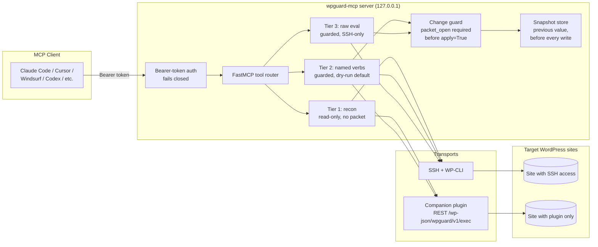

# wpguard-mcp

An [MCP](https://modelcontextprotocol.io) server that lets any MCP-compatible AI client — Claude Code, Cursor, Windsurf, Codex, or anything else that speaks the protocol — safely recon, mutate, and verify WordPress sites.

## The idea

Most "WordPress + AI" MCP tools expose one primary interface: run arbitrary PHP. That's honest about what it is — full access, full responsibility — but it means every single tool call is one bad prompt away from `wp_delete_post` on the wrong ID, a truncated `wp_options` table, or a silently broken production site. The safety model is "the agent doesn't hallucinate a destructive call," which is not a safety model.

wpguard-mcp inverts that default:

- **The front door is a small set of named, typed verbs** — `wp_mutate_option`, `wp_mutate_post_meta`, `wp_mutate_post_content`, `wp_cache_bust` — each of which knows exactly what it touches and what it changed.
- **Every verb previews before it writes.** Call it with no arguments changed and it dry-runs by default (`apply=False`) and shows you the diff. Nothing happens to the live site until you explicitly say `apply=True`.
- **Every write requires a stated reason first.** You can't run an `apply=True` mutation without an open *change packet* — a one-line audit record naming the site, the intent, and a risk level. No packet, no write. This is the part most AI-ops tools skip: the guard doesn't check "is this call well-formed," it checks "did anyone say why this is happening."
- **Every write snapshots the previous value first**, so a rollback is always "read this snapshot, write it back" instead of "hope you remember what it used to say."
- **Raw PHP/WP-CLI eval still exists** (`wp_eval`, Tier 3) — sometimes you genuinely need it — but it's gated by the exact same change-packet guard as everything else, it's SSH-only, and it's a deliberately separate, harder-to-reach tool rather than the default way of doing anything.

If you only remember one sentence: **named verbs are the front door, raw eval is the fire escape, and nothing writes without an open packet.**

## Architecture



Two ways to reach a site, same guarded verbs on both:

- **SSH transport** — shells out to `wp-cli` over SSH for sites you operate directly. This is the only transport that can reach Tier 3 (`wp_eval`).
- **Companion-plugin transport** — HTTPS POST to a small WordPress plugin's REST route (`wp-plugin/wpguard-companion.php`) for sites where you only have the plugin installed, not SSH. The plugin has a hard command whitelist and **no eval capability at all** — that boundary is enforced in PHP, not just in the Python client.

## Quickstart

### 1. Install

```bash
git clone https://github.com/cgallic/wpguard-mcp.git
cd wpguard-mcp
python -m venv .venv
source .venv/bin/activate   # or .venv\Scripts\activate on Windows
pip install -e .
```

### 2. Configure

```bash
cp .env.example .env
python -c "import secrets; print(secrets.token_hex(32))"   # generate WPGUARD_MCP_TOKEN
# edit .env, set WPGUARD_MCP_TOKEN to the generated value
```

Environment variables (see `.env.example` for the full list):

| Variable | Required | Purpose |
|---|---|---|
| `WPGUARD_MCP_TOKEN` | yes | Bearer token every MCP client must send. Server refuses to start / rejects everything without it. |
| `WPGUARD_MCP_HOST` | no | Default `127.0.0.1`. |
| `WPGUARD_MCP_PORT` | no | Default `8642`. |
| `WPGUARD_STATE_DIR` | no | Default `state`. Holds the packet ledger, snapshots, and site registry (all gitignored). |
| `WPGUARD_BYPASS_GUARD` | no | Set `1` to let `apply=True` calls skip the open-packet requirement. Dangerous — see [Bypass](#bypass-escape-valve) below. |
| `WPGUARD_SITE_<NAME>_KEY` (your own naming) | per site | API key for a companion-plugin-transport site, referenced by env-var name from that site's registry entry — never stored in the registry file itself. |

### 3. Run the server

```bash
WPGUARD_MCP_TOKEN=... python -m wpguard_mcp.server
# or, once installed: WPGUARD_MCP_TOKEN=... wpguard-mcp
```

This starts a streamable-HTTP MCP server on `http://127.0.0.1:8642/mcp`, bound to loopback by default.

### 4. Connect an MCP client

Any MCP client that supports streamable-HTTP transport with a custom header works. Example config shape (Claude Code / similar):

```json
{
  "mcpServers": {
    "wpguard": {
      "url": "http://127.0.0.1:8642/mcp",
      "headers": {
        "Authorization": "Bearer <your WPGUARD_MCP_TOKEN>"
      }
    }
  }
}
```

## Tool catalog

| Tier | Tool | Guarded? | Apply flag? | What it does |
|---|---|---|---|---|
| 1 | `wp_recon` | no | — | Core version, active plugins/theme, site URL. |
| 1 | `wp_get_option` | no | — | Read one WP option. |
| 1 | `wp_get_post_meta` | no | — | Read one post-meta value. |
| 1 | `site_list` | no | — | List registered sites (no secrets included). |
| 2 | `wp_mutate_option` | yes | yes | Update a WP option. Dry-run previews old vs. new value. |
| 2 | `wp_mutate_post_meta` | yes | yes | Update a post's meta value. Dry-run previews old vs. new value. |
| 2 | `wp_mutate_post_content` | yes | yes | Search/replace within one post's content. Dry-run reports match count. |
| 2 | `wp_cache_bust` | **no** | — | Flush cache. Not guarded — no content change, nothing to roll back. |
| 3 | `wp_eval` | yes | yes | Run arbitrary PHP via `wp eval`. **SSH-only.** Escape hatch, not the default. |
| — | `packet_open` | — | — | Open a change packet for a site: `{site, summary, risk}`. |
| — | `packet_log` | — | — | Append a note to an open packet. |
| — | `packet_close` | — | — | Close a packet with an outcome summary. |
| — | `packet_list` | — | — | List packets, optionally filtered by site / open-only. |
| — | `site_register` | — | — | Register a site's SSH or companion-plugin connection info. |

"Guarded" means: `apply=True` raises `PacketRequiredError` unless there's a currently-open packet for that exact site (or `WPGUARD_BYPASS_GUARD=1` is set).

## The guarded-change lifecycle

This is the shape every real mutation should take, end to end:

```
1. site_register(name="example-blog", transport="ssh", ssh_host="example.com", ...)
2. wp_recon(site="example-blog")
     -> confirms the site, WP version, active plugins, before touching anything

3. packet_open(site="example-blog", summary="Update site tagline for spring promo", risk="low")
     -> returns {id: "a1b2c3d4e5f6", ...}

4. wp_mutate_option(site="example-blog", option_name="blogdescription",
                     new_value="Spring Sale — 20% off everything")
     -> apply defaults to False: dry-run, returns {previous_value, proposed_value}, no write happens

   # review the diff, decide it's correct

5. wp_mutate_option(site="example-blog", option_name="blogdescription",
                     new_value="Spring Sale — 20% off everything", apply=True)
     -> requires the packet opened in step 3; snapshots the previous value first,
        then writes; returns {previous_value, new_value, packet_id, snapshot_id}

6. wp_get_option(site="example-blog", option_name="blogdescription")
     -> verify: read it back, confirm it matches what you just wrote

7. packet_close(packet_id="a1b2c3d4e5f6",
                 outcome="Verified via wp_get_option; tagline updated, homepage confirmed")
```

If step 5 is attempted without step 3 having happened first, it fails immediately with `PacketRequiredError` — no write, no snapshot, nothing touched. That's the whole point: intent has to exist *before* the action, not get reconstructed from logs after the fact.

### Bypass (escape valve)

`WPGUARD_BYPASS_GUARD=1` lets `apply=True` calls run without an open packet. It exists for local development against a throwaway WP install, not for anything you'd call production. It is a single global on/off switch, not a per-tool or per-site allowance — turning it on turns off the guard for every guarded tool call the server makes until you turn it back off. Treat it like `sudo` with no password prompt.

## Companion plugin

For sites you don't operate over SSH, install `wp-plugin/wpguard-companion.php` (drop it in `wp-content/plugins/`, activate it from wp-admin). It exposes exactly one REST route, `/wp-json/wpguard/v1/exec`, and:

- Requires a matching `X-WPGuard-Key` header (timing-safe comparison) — wrong or missing key returns `401`.
- Only runs commands on a hardcoded whitelist (`recon`, `get_option`, `update_option`, `get_post_meta`, `update_post_meta`, `search_replace_post_content`, `cache_flush`) — anything else returns `400`.
- **Has no eval, no shell-exec, no arbitrary-file-write command, ever.** That boundary is enforced inside the plugin itself, not just by convention on the client side. If you need `wp_eval`, that site needs to be registered with the `ssh` transport instead.

Configure the key in `wp-config.php`:

```php
define( 'WPGUARD_COMPANION_API_KEY', 'paste-a-long-random-string-here' );
```

Then register the site pointing `plugin_api_key_env` at whatever env var on your machine holds that same value:

```
site_register(name="example-blog-2", transport="companion_plugin",
               plugin_url="https://example2.com/wp-json/wpguard/v1/exec",
               plugin_api_key_env="WPGUARD_SITE_EXAMPLE_BLOG_2_KEY")
```

## Local state

Everything wpguard-mcp remembers lives under `WPGUARD_STATE_DIR` (default `./state`), as plain JSON — no database dependency for v1:

```
state/
├── config/
│   └── sites.json         # registered sites (connection metadata only, no secrets)
└── packets/
    ├── packets.jsonl       # append-only change-packet ledger
    └── snapshots.jsonl     # append-only pre-write snapshots, keyed by packet
```

All of it is gitignored by default. Back it up like you would any other audit log.

## Development

```bash
pip install -e ".[dev]"
python -m pytest
```

## License

MIT, see `LICENSE`.
