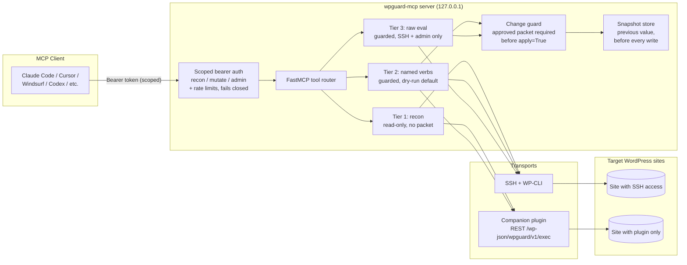

# wpguard-mcp

A **guarded WordPress MCP server**: it lets any MCP-compatible AI client — Claude Code, Cursor, Windsurf, Codex, or anything else that speaks the protocol — recon, mutate, and verify WordPress sites through **named, typed verbs instead of raw PHP execution**.

## Capability-scoped by design

**The AI never gets raw code execution as a normal tool.** It gets specific named actions — *update this option, edit this post, bust this cache* — and each one previews, backs up, and requires a stated-and-approved reason before it touches the live site. Raw PHP execution still exists for the rare case you truly need it, but it's opt-in, separately scoped, and never the default path.

That's the whole design in one line: **named verbs are the front door; raw eval is a gated fire escape; nothing writes without an approved change packet.**

This matters because the rest of the space largely inverts it. Most "WordPress + AI" MCP servers put **raw PHP execution at the front door** — the agent's primary interface is "run this code." That's honest about what it is (full access, full responsibility), but it means every call is one bad prompt away from `wp_delete_post` on the wrong ID or a truncated `wp_options` table, and "the agent won't hallucinate a destructive call" is not a safety model. Adding an audit log on top of *the AI can run arbitrary PHP* is now table stakes, not a differentiator. **Closed-by-default — named actions first, raw execution gated behind an explicit tier — is an architectural difference, not a logging feature.**

Concretely, that closed-by-default posture is three tiers:

- **Tier 1 — recon (read-only).** `wp_recon`, `wp_get_option`, `wp_get_post_meta`. No packet, no risk of a write.
- **Tier 2 — guarded named verbs.** `wp_mutate_option`, `wp_mutate_post_meta`, `wp_mutate_post_content`, `wp_cache_bust`. Each **dry-runs by default** and refuses to write without an approved packet.
- **Tier 3 — the raw-eval escape hatch.** `wp_eval` runs arbitrary PHP over SSH. Same approval guard as everything else, `admin`-scoped only, deliberately harder to reach than any named verb.

## How it compares

Where wpguard-mcp sits relative to the other tools you'll evaluate. Sourced and current as of July 2026 — verify against each project's current docs before relying on a cell, the space moves fast.

| | Raw PHP/eval as the default interface? | Dry-run before write? | Backup/snapshot before write? | Change-approval gate (beyond role permission)? | Block-structural edits? | Transport |
|---|---|---|---|---|---|---|
| **[Novamira][nov]** | **Yes** — PHP execution is the primary interface | No | No | No¹ | No (operates at raw PHP level) | Plugin (App Password / HTTPS) |
| **[WordPress/mcp-adapter][adp]** (official) | No — invokes registered *abilities* | Per-ability | No | No² | Depends on registered abilities | Plugin (HTTP/STDIO, Abilities API) |
| **[GravityKit Block MCP][blk]** | No | — | **Yes** — native WP revisions + `revert_to_revision` | No | **Yes** — its defining feature | Plugin |
| **[InstaWP / InstaMCP][iwp]** | No — `execute_php` off by default, 4 guard layers | Via staging clone (test-then-promote) | Via disposable staging clone | No | — | Plugin + hosted staging |
| **wpguard-mcp** | **No** — named verbs default; raw eval is gated Tier 3, SSH-only | **Yes** — `apply=False` is the default on every verb | **Yes** — before every write, plus optional durable re-verify | **Yes** — propose/approve *change packet*, distinct from role/token | No — raw search/replace today (block-aware verb planned, [#4][i4]) | SSH+WP-CLI **or** companion plugin (plugin has no eval) |

¹ Novamira authenticates via WordPress Application Passwords and the capability system, but doesn't add a separate per-change approval step on top of *the AI can run arbitrary PHP*.
² The MCP Adapter enforces per-ability `permission_callback` (WordPress capabilities) — that's a *role/permission* check, not a distinct "someone approved this specific change" gate. Cells marked "—" weren't a documented, distinct feature of that tool as of the sources below.

Human-in-the-loop review and audit logging are increasingly standard across the field (InstaWP staging review, Block MCP revisions, and others), so wpguard-mcp doesn't lead on those alone. Its distinct posture is **named-verb-by-default with a deliberately gated raw-eval escape hatch, structured as explicit tiers** — most tools gate raw PHP *somewhere*, but don't make named verbs the front door and raw execution a separate, harder-to-reach tier.

[nov]: https://github.com/use-novamira/novamira
[adp]: https://github.com/WordPress/mcp-adapter
[blk]: https://github.com/GravityKit/block-mcp
[iwp]: https://instawp.com/wordpress-mcp-server/
[i4]: https://github.com/cgallic/wpguard-mcp/issues/4

## Architecture



Two ways to reach a site, same guarded verbs on both:

- **SSH transport** — shells out to `wp-cli` over SSH for sites you operate directly. This is the only transport that can reach Tier 3 (`wp_eval`).
- **Companion-plugin transport** — HTTPS POST to a small WordPress plugin's REST route (`wp-plugin/wpguard-companion.php`) for sites where you only have the plugin installed, not SSH. The plugin has a hard command whitelist and **no eval capability at all** — that boundary is enforced in PHP, not just in the Python client.

## Distribution

wpguard-mcp is **self-hosted, from GitHub** — the same distribution model every comparable tool in this space uses. It is intentionally **not** on the WordPress.org plugin directory: WP.org guidelines prohibit plugins that provide arbitrary code execution, and even though the companion plugin has *no* raw-eval capability (only a whitelisted verb set), a plugin whose purpose is "let a remote MCP server perform administrative operations" is very unlikely to clear review. Install via the Docker image, `pip`, or by dropping the companion plugin in from a release — see below. This is a deliberate decision, not an oversight ([#15](https://github.com/cgallic/wpguard-mcp/issues/15)).

## Quickstart

### Option A — Docker (recommended)

```bash
cp .env.example .env
python -c "import secrets; print(secrets.token_hex(32))"   # generate a token
# edit .env: set WPGUARD_MCP_TOKEN to the generated value
docker compose up -d
```

The server comes up on `http://127.0.0.1:8642/mcp`, bound to loopback, with the packet ledger / snapshots / site registry persisted in a named volume. The image is published to `ghcr.io/cgallic/wpguard-mcp`.

### Option B — pip (for developing on this repo)

```bash
git clone https://github.com/cgallic/wpguard-mcp.git
cd wpguard-mcp
python -m venv .venv && source .venv/bin/activate
pip install -e .
WPGUARD_MCP_TOKEN=... wpguard-mcp
```

### Connect a client

Any MCP client that speaks streamable-HTTP with a custom header works. Full copy-pasteable snippets for Claude Code, Cursor, Windsurf, and Codex are in **[docs/clients.md](docs/clients.md)**. The short version:

```json
{
  "mcpServers": {
    "wpguard": {
      "type": "http",
      "url": "http://127.0.0.1:8642/mcp",
      "headers": { "Authorization": "Bearer <your WPGUARD_MCP_TOKEN>" }
    }
  }
}
```

### Configuration

| Variable | Required | Purpose |
|---|---|---|
| `WPGUARD_MCP_TOKEN` | one token, min. | Admin-scoped bearer token. Server refuses to start / rejects everything without at least one token configured. |
| `WPGUARD_TOKEN_RECON` / `_MUTATE` / `_ADMIN` | no | Scoped tokens (comma-separated) — see [Token scopes](#token-scopes). |
| `WPGUARD_MCP_HOST` / `WPGUARD_MCP_PORT` | no | Default `127.0.0.1` / `8642`. |
| `WPGUARD_STATE_DIR` | no | Default `state`. Packet ledger, snapshots, site registry (all gitignored). |
| `WPGUARD_LOCK_TTL_SECONDS` | no | Per-target packet lock TTL. Default `3600`. |
| `WPGUARD_RATE_LIMIT_PER_MIN` / `_TIER3_PER_MIN` | no | Per-token call caps. Defaults `120` / `10`. |
| `WPGUARD_CLOUD_REPORT_URL` / `_API_KEY` | no | Optional packet-lifecycle reporting hook — [Notifications](#notifications--cloud-reporting). |
| `WPGUARD_NOTIFY_WEBHOOKS` / `_EVENTS` | no | Optional Slack/Discord notification webhooks. |
| `WPGUARD_BYPASS_GUARD` | no | `1` disables the packet requirement globally. **Dangerous — dev only.** |

## Token scopes

Auth is a scoped bearer token, so you can practice least-privilege across multiple AI clients instead of handing every one the keys to raw eval. Three scopes, each a superset of the one below:

| Scope | Env var | Reaches | Example holder |
|---|---|---|---|
| `recon` | `WPGUARD_TOKEN_RECON` | Tier 1 read-only | A low-trust monitoring/analysis harness |
| `mutate` | `WPGUARD_TOKEN_MUTATE` | Tier 1 + Tier 2 + packet lifecycle | A content-ops agent |
| `admin` | `WPGUARD_TOKEN_ADMIN` (or legacy `WPGUARD_MCP_TOKEN`) | Everything, including Tier 3 `wp_eval` | You, for break-glass fixes |

A token calling above its scope gets a clear `403`; hammering the server past the rate limit gets a `429`. Tier 3 has a **tighter** rate limit than Tier 1/2 by default, given raw eval's blast radius.

## Tool catalog

| Tier | Tool | Guarded? | Apply flag? | What it does |
|---|---|---|---|---|
| 1 | `wp_recon` | no | — | Core version, active plugins/theme, site URL. |
| 1 | `wp_get_option` | no | — | Read one WP option (wrapped as untrusted content). |
| 1 | `wp_get_post_meta` | no | — | Read one post-meta value (wrapped as untrusted content). |
| 1 | `site_list` | no | — | List registered sites (no secrets included). |
| 2 | `wp_mutate_option` | yes | yes | Update a WP option. Dry-run previews old vs. new + an etag. |
| 2 | `wp_mutate_post_meta` | yes | yes | Update a post's meta value. Dry-run previews old vs. new. |
| 2 | `wp_mutate_post_content` | yes | yes | Search/replace within one post's content. Dry-run reports match count. |
| 2 | `wp_cache_bust` | **no** | — | Flush cache. Not guarded — no content change to roll back. |
| 3 | `wp_eval` | yes | yes | Run arbitrary PHP via `wp eval`. **SSH + admin only.** Escape hatch. |
| — | `packet_open` | — | — | **Propose** a change packet: `{site, summary, risk, target}`. |
| — | `packet_approve` | — | — | **Authorize** a proposed packet. Only approved packets satisfy the guard. |
| — | `packet_log` | — | — | Append a note to an open packet. |
| — | `packet_close` | — | — | Close a packet; optional durable re-verify. |
| — | `packet_list` | — | — | List packets by site / open / status. |
| — | `site_register` | — | — | Register a site's SSH or companion-plugin connection info. |

"Guarded" means: `apply=True` raises `PacketRequiredError` unless there's an **approved**, currently-open packet for that exact site (or `WPGUARD_BYPASS_GUARD=1` is set).

## The guarded-change lifecycle

This is the shape every real mutation takes, end to end — a **dry-run WordPress AI agent** flow where intent exists, and is approved, *before* the write:

```
1. site_register(name="example-blog", transport="ssh", ssh_host="example.com", ...)
2. wp_recon(site="example-blog")
     -> confirms the site, WP version, active plugins, before touching anything

3. packet_open(site="example-blog", summary="Update tagline for spring promo",
                risk="low", target="option:blogdescription")
     -> returns {id: "a1b2c3d4e5f6", status: "proposed", ...}
        and takes a lock on that target so another agent can't race it

4. packet_approve(packet_id="a1b2c3d4e5f6", approver="connor")
     -> status: "approved" -- the proposer and the approver can be different actors

5. wp_mutate_option(site="example-blog", option_name="blogdescription",
                     new_value="Spring Sale — 20% off everything")
     -> apply defaults to False: dry-run, returns {previous_value, proposed_value, etag}, no write

   # review the diff, decide it's correct

6. wp_mutate_option(..., new_value="Spring Sale — 20% off everything",
                     apply=True, expected_etag="<etag from step 5>")
     -> requires the approved packet; refuses if the value changed since the dry-run;
        snapshots the previous value first (backup-before-write), then writes

7. wp_get_option(site="example-blog", option_name="blogdescription")
     -> verify: read it back, confirm it matches

8. packet_close(packet_id="a1b2c3d4e5f6", outcome="Verified via wp_get_option",
                 durable_check_delay_seconds=30)
     -> optionally re-reads after 30s and closes as verify_failed if it drifted back
```

If step 6 is attempted without an *approved* packet, it fails immediately with `PacketRequiredError` — no write, no snapshot, nothing touched.

### Safety mechanics, briefly

- **Propose vs. approve ([#1][i1]).** `packet_open` only proposes; `packet_approve` authorizes. Every Tier 2/3 tool funnels through one shared guard, and a test enumerates all guarded tools to prove none can skip it.
- **Per-target locks ([#3][i3]).** An open packet locks its `site:target`; a second packet on an overlapping target fails fast instead of racing. Locks auto-expire.
- **Optimistic concurrency ([#6][i6]).** Pass the dry-run's `etag` back as `expected_etag` to refuse a **rollback-safe** overwrite of a value that changed underneath you.
- **Durable re-verify ([#2][i2]).** `packet_close(durable_check_delay_seconds=...)` re-reads mutated values after a delay and flags drift (a cache serving stale content, a plugin rewriting the field).
- **Recon is untrusted input ([#9][i9]).** Tier 1 output is wrapped in an `untrusted_content` envelope and scanned for instruction-like text — treat all recon output as *data*, never instructions.

[i1]: https://github.com/cgallic/wpguard-mcp/issues/1
[i2]: https://github.com/cgallic/wpguard-mcp/issues/2
[i3]: https://github.com/cgallic/wpguard-mcp/issues/3
[i6]: https://github.com/cgallic/wpguard-mcp/issues/6
[i9]: https://github.com/cgallic/wpguard-mcp/issues/9

### Bypass (escape valve)

`WPGUARD_BYPASS_GUARD=1` lets `apply=True` calls run without an approved packet. It exists for local development against a throwaway WP install, not for production. It's a single global switch, not per-tool — treat it like `sudo` with no password prompt. See [SECURITY.md](SECURITY.md).

## Audit log

The packet ledger is JSONL on disk (source of truth), but you review it with a read-only CLI rather than grepping files:

```bash
wpguard audit                      # everything
wpguard audit --site example.com   # one site
wpguard audit --since 7d           # opened in the last 7 days
wpguard audit --status approved    # only approved packets
wpguard audit --json               # machine-readable
```

It renders each packet, its approval, its snapshots (previous → new), and verify status as a timeline.

## Notifications & cloud reporting

Both are **entirely optional and best-effort** — a delivery failure never blocks or fails the underlying operation, and with these unset there are zero extra network calls.

- **Notification webhooks** — set `WPGUARD_NOTIFY_WEBHOOKS` (comma-separated) to POST a human-readable message on selected events (`WPGUARD_NOTIFY_EVENTS`). Slack incoming-webhook and Discord webhook URLs both work as-is. Raw eval (`tier3_eval_fired`) always notifies. This is what makes the approval workflow function day-to-day: a packet that needs approval actually pings someone.
- **Cloud-reporting hook** — set `WPGUARD_CLOUD_REPORT_URL` (+ optional `WPGUARD_CLOUD_API_KEY`) to push packet-lifecycle **metadata** (site, target, summary, risk, status, timestamps — never full content, never credentials) to a control plane such as [wpguard-cloud](https://github.com/cgallic/wpguard-cloud). The open-source core stays complete and useful with this unset; it's a thin optional hook, not a dependency.

## Companion plugin

For sites you don't operate over SSH, install `wp-plugin/wpguard-companion.php` (drop it in `wp-content/plugins/`, activate from wp-admin). It exposes exactly one REST route, `/wp-json/wpguard/v1/exec`, and:

- Requires a matching `X-WPGuard-Key` header (timing-safe) — wrong/missing key returns `401`.
- Only runs a hardcoded whitelist (`recon`, `get_option`, `update_option`, `get_post_meta`, `update_post_meta`, `search_replace_post_content`, `cache_flush`) — anything else returns `400`.
- **Has no eval, no shell-exec, no arbitrary-file-write, ever** — enforced inside the plugin, not just on the client side. If you need `wp_eval`, that site needs the `ssh` transport.

Configure the key in `wp-config.php`:

```php
define( 'WPGUARD_COMPANION_API_KEY', 'paste-a-long-random-string-here' );
```

Then register the site pointing `plugin_api_key_env` at whatever env var on your machine holds that same value:

```
site_register(name="example-blog-2", transport="companion_plugin",
               plugin_url="https://example2.com/wp-json/wpguard/v1/exec",
               plugin_api_key_env="WPGUARD_SITE_EXAMPLE_BLOG_2_KEY")
```

## Site layouts (classic & Bedrock)

`site_register` takes a `layout` for SSH sites: `classic` (default — WP core at `wp_path`) or `bedrock` (Composer/[Bedrock](https://roots.io/bedrock/) — core lives under `web/wp`). wp-cli's `--path` resolves accordingly, so the SSH transport works against both without hardcoded path assumptions.

```
# Bedrock/Composer install
site_register(name="bedrock-site", transport="ssh", ssh_host="example.com",
               wp_path="/srv/app", layout="bedrock")   # -> wp-cli --path=/srv/app/web/wp
```

## Local state

Everything wpguard-mcp remembers lives under `WPGUARD_STATE_DIR` (default `./state`), as plain JSON — no database dependency for v1:

```
state/
├── config/
│   └── sites.json         # registered sites (connection metadata only, no secrets)
└── packets/
    ├── packets.jsonl       # append-only change-packet ledger
    └── snapshots.jsonl      # append-only pre-write snapshots, keyed by packet
```

All of it is gitignored by default. Back it up like you would any other audit log.

## Security

wpguard-mcp writes to live sites; read **[SECURITY.md](SECURITY.md)** before deploying it. It covers the trust boundaries, what the guard does and does *not* protect against (notably: it stops accidents, not a fully-authorized malicious caller), the known open risks, deployment guidance, and how to report a vulnerability.

## Development

```bash
pip install -e ".[dev]"
ruff check .        # lint
mypy                # type check
pytest -q           # tests
```

CI runs all three on every PR across Python 3.10–3.12.

## License

MIT, see `LICENSE`.
